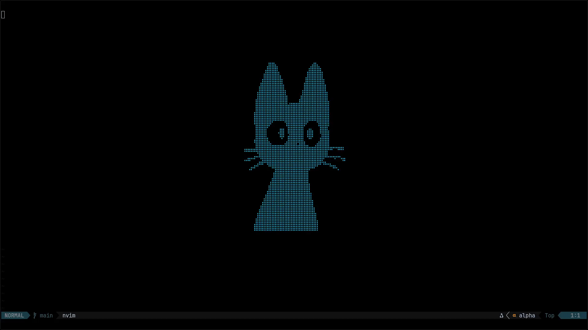

# capsdetect.nvim
  Windows, Linux and MacOS CAPS detector and indicator for Neovim

# Usage
## Lazy.nvim
```lua
return {
  "nikita-edel/capsdetect.nvim",
}
```
## Configuration

```lua
return {
	dir = "~/dev/capsdetect.nvim",
	config = function()
		require("capsdetect.nvim").setup({
          -- those are the defaults
	      schedule = {
		      no_schedule = false, -- turns of the scheduler / updater
		      refresh_ms = 200, -- rate at which the update happens
            -- user provided call back with signature:
            -- act_on(state) where state is a bool
            -- which is setting the variable / updating the window
		      callback = nil,
		      use_indicator = true, -- use the builtin indicator
            -- decides if the global vim variable:
            -- vim.g.caps_state gets updated on schedule or not set at all
		      update_global = true, 
	      },
		})
	end,
}
```

## functions
this plugin exposes:
- `get_caps_state()` which is the platforms specific function that returns a bool
- `start()` and `stop()`
- and the global variable `vim.g.caps_state` if not turned off (it wont be set)

# Indicator
The builtin indiciator is a small window that follows above the cursor:



# Contribution
I did not test for MacOS scince i dont have it installed nor an Apple device, feed back would be nice.  
feel free to submit a pr for more supported platforms
